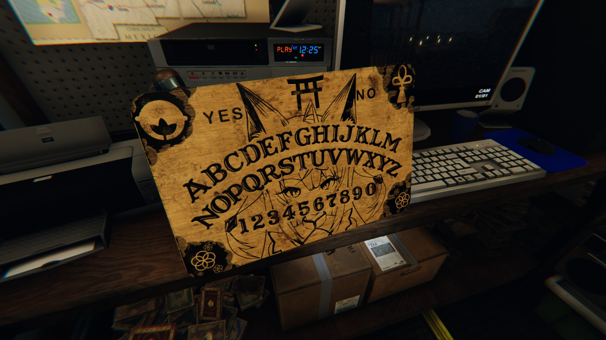

# Name

Phasmophobia Kurune Kokuri Texture Mod

# DEMO

# Features

Phasmophobiaのテクスチャーファイルを変更します。  
Change the texture file of Phasmophobia.  

# Requirement

* Phasmophobia BUILDID.8181468
* [Steam Phasmophobia Builds heatmap](https://steamdb.info/app/739630/patchnotes/)

# Releases

* [Phasmophobia-Kurune_Kokuri-Texture_Mod Download](https://github.com/xbmc-now/Phasmophobia-Kurune_Kokuri-Texture_Mod/releases/tag/Phasmophobia-Kurune_Kokuri-Texture_Mod)

# Installation

まずPhasmophobiaのバージョンを確認してください。Phasmophobiaは頻繁にアップデートが行われるゲームです。  
そのため、バージョンが違うとインストールできないようにしています。  
バージョンが最新版と異なる場合は、対応するまで待ってください。  
なお、一度インストールしても、アップデートが行われると標準の状態に戻されてしまいます。
First check the version of Phasmophobia. Phasmophobia is a game that is updated frequently.  
Therefore, it cannot be installed if the version is different.  
If the version is different from the latest version, please wait until it is supported.  
Even if you install it once, it will be returned to the standard state when the update is performed.  

リリースファイルをダウンロードして、その中にあるinstall.vbsをダブルクリックしてください。  
アンインスールはuninstall.vbsをダブルクリックしてください。  
Download the release file and double-click install.vbs in it.  
Double-click uninstall.vbs to uninstall.  

steamクライアントのPhasmophobiaのプロパティを開き、「ゲームファイルの整合性を確認」をクリックすることでも、正規の状態に戻すことができます。  
You can also return to the normal state by opening the properties of Phasmophobia on the steam client and clicking "Check game file integrity".  

# Usage

# Note

自分の環境でしか試しておりません。自己責任でお願いします。  
動作した、動作しなかった等、連絡いただけると助かります。  
I have only tried it in my environment. Please take responsibility for your actions.  
It would be helpful if you could contact us if it worked or did not work.  

UABE(Unity Assets Bundle Extractor)というツールで編集していますが、実はこのツールでテクスチャーを変更する実行EXEも生成できます。  
ただ現状は実行EXEを配布するのは怖いので、ファイルを置き換えるようにしています。  
I am editing with a tool called UABE (Unity Assets Bundle Extractor), but in fact, I can also generate an executable EXE that changes the texture with this tool.  
However, at present, it is scary to distribute the execution EXE, so I try to replace the file.  

# Author

* xbmc_now
* [@xbmc_now](https://twitter.com/xbmc_now)

# License
